# Projeto de Programação - N04 - GRUPO 06 - Notificação
## Objetivo do módulo desenvolvido (Módulo Notificação)
* Criar classes
* Implementar envio automático de mensagens (confirmações, lembretes,
cancelamentos)
* Impedir conflitos de notificações
* **Implementar fila de mensagens para evitar sobrecarga (notificações em
lote)**
* **Permitir histórico de notificações enviadas e recebidas por usuário**
* **Adicionar controle de status (enviado, lido, não lido)**
* Criar repositório para persistir dados
    * **Criar as tabelas notificacao e mensagem**
    * **Implementar o repositório NotificacaoRepository com operações CRUD**
    * **Criar método para registrar o envio de notificações (data, tipo e destinatário)**
    * **Integrar com módulos de pagamento e eventos (por exemplo: pagamento confirmado → notificação enviada)**
* Criar repositório e interface visual para visualização das notificações. **(Frontend)**
* Testar
* EXTRA (+0,5):
    * Simular envio de e-mails automáticos
    * Adicionar configuração de preferências de notificação por usuário
    * Registrar logs de notificações e implementar filtro por tipo (aviso,
lembrete e alerta)
## Bibliotecas utilizadas
* Spring Boot - 3.5.6
    * Spring Boot Dev Tools
    * Spring Web
    * Spring Data JPA
    * MySQL Driver
    * Validation 
    * Lombok
    * Starter Mail
* Java 21
* Frontend
    * Next.js v16.0.0
    * React v19.2.0
    * TypeScript - v5
    * Tailwind CSS - v4.1.9 (com `autoprefixer` v10.4.20)
    * Dependências (conforme `frontend/package.json`):
        * @hookform/resolvers v3.10.0
        * @radix-ui/react-accordion v1.2.2
        * @radix-ui/react-alert-dialog v1.1.4
        * @radix-ui/react-aspect-ratio v1.1.1
        * @radix-ui/react-avatar v1.1.2
        * @radix-ui/react-checkbox v1.1.3
        * @radix-ui/react-collapsible v1.1.2
        * @radix-ui/react-context-menu v2.2.4
        * @radix-ui/react-dialog v1.1.4
        * @radix-ui/react-dropdown-menu v2.1.4
        * @radix-ui/react-hover-card v1.1.4
        * @radix-ui/react-label v2.1.1
        * @radix-ui/react-menubar v1.1.4
        * @radix-ui/react-navigation-menu v1.2.3
        * @radix-ui/react-popover v1.1.4
        * @radix-ui/react-progress v1.1.1
        * @radix-ui/react-radio-group v1.2.2
        * @radix-ui/react-scroll-area v1.2.2
        * @radix-ui/react-select v2.1.4
        * @radix-ui/react-separator v1.1.1
        * @radix-ui/react-slider v1.2.2
        * @radix-ui/react-slot v1.1.1
        * @radix-ui/react-switch v1.1.2
        * @radix-ui/react-tabs v1.1.2
        * @radix-ui/react-toast v1.2.4
        * @radix-ui/react-toggle v1.1.1
        * @radix-ui/react-toggle-group v1.1.1
        * @radix-ui/react-tooltip v1.1.6
        * @vercel/analytics (latest)
        * autoprefixer v10.4.20
        * class-variance-authority v0.7.1
        * clsx v2.1.1
        * cmdk v1.0.4
        * date-fns v4.1.0
        * embla-carousel-react v8.5.1
        * input-otp v1.4.1
        * lucide-react v0.454.0
        * next v16.0.0
        * next-themes v0.4.6
        * react v19.2.0
        * react-day-picker v9.8.0
        * react-dom v19.2.0
        * react-hook-form v7.60.0
        * react-resizable-panels v2.1.7
        * recharts v2.15.4
        * sonner v1.7.4
        * tailwind-merge v2.5.5
        * tailwindcss-animate v1.0.7
        * vaul v0.9.9
        * zod v3.25.76
    * DevDependencies:
        * @tailwindcss/postcss v4.1.9
        * @types/node v22
        * @types/react v19
        * @types/react-dom v19
        * postcss v8.5
        * tailwindcss v4.1.9
        * tw-animate-css v1.3.3
        * typescript v5
## Instruções de execução
Pré-requisitos:

- Docker Desktop instalado e em execução.
- Abrir um terminal PowerShell na raiz do projeto (a pasta que contém o `docker-compose.yml`).

1. Construir e subir os containers:

```powershell
docker-compose up --build
```

2. Verificar status dos serviços (opcional):

```powershell
docker-compose ps
```

3. Acessar a aplicação:

- Frontend: `http://localhost:3000`
- Backend (API): `http://localhost:8080`

### Caso precise reniciar os containers
* Parar e remover containers (mantendo volumes):

```powershell
docker-compose down
```

* Parar, remover containers e volumes (reset completo do banco de dados):

```powershell
docker-compose down -v
```

Observações sobre o banco de dados:

- O serviço `mysql` utiliza a imagem `mysql:8.0` e monta o arquivo `./sql/BancoSQL_Grupo06.sql` em `/docker-entrypoint-initdb.d/` para inicializar o schema quando o container é criado pela primeira vez.
- Se precisar reimportar o SQL inicial, pare com `docker-compose down -v` e execute novamente `docker-compose up --build -d`.

Executando o frontend localmente (opcional):

```powershell
cd frontend
    # Recomenda-se usar pnpm por causa do `pnpm-lock.yaml`
pnpm install
pnpm dev
    # ou, se preferir
npm install
npm run dev
```
Executando o backend localmente (opcional):

Modificar o application.properties para o banco de dados local.
```
spring.datasource.url=jdbc:mysql://localhost:3306/gerenciador_evento_api?useSSL=false&serverTimezone=UTC
spring.datasource.username={user do MySQL} (Exemplo: root)
spring.datasource.password={senha do user do MySQL} (Exemplo: root123)
```

## Mudanças
1. Decidimos utilizar /app ao invés de /src
2. As mudanças da semana 1 estão nas branchs de cada colaborador do grupo.
3. Decidimos fazer isso devido a mudança do projeto para Spring Boot na semana 2.

## Observações
1. Foi utilizado a LLM [v0](https://v0.app/) para criação da base do Frontend e o [GitHub Copilot](https://github.com/features/copilot?locale=pt-BR) para continuidade do desenvolvimento.
2. Remoção dos casos de uso referentes a Tipos de Pagamentos.
3. Remoção do caso de uso Responder Notificação.
4. Remoção dos casos de uso Telefone e Push que informava como a notificação era enviada.
5. A fila proposta nos objetivos é feita a partir de uma lista que carrega os ids dos destinatários no atributo `destinatarios` em notificação onde é notificado usuário a usuário em ordem de chegada.
6. Pasta `prints_exemplos` comtém os prints do exemplo de saída

[Diagrama Caso de Uso](https://drive.google.com/file/d/1VfohNCQWRZp4bpNb3Xq1ckoFzHwvSEOg/view?pli=1)
## Responsabilidades de cada integrante
| Nome | Responsabilidades |
| ------------- |:-------------:|
| Iago Vieira Rocha | Desenvolvimento do frontend (telas, componentes e estilos), implementação das classes `Pagamentos` e `Tags` (models, serviços e endpoints), e execução de testes manuais relacionados às funcionalidades de pagamentos e tags. |
| João Gabriel Mendonça Ribeiro | Implementação da entidade `Usuário` (model, serviço e endpoints), criação de vídeos de demonstração do sistema e execução de testes manuais do módulo de usuários. |
| João Paulo Lordêlo Pedreira Vivas | Implementação das funcionalidades de Notificações classes `Notificações`, `LogsNotificacao` e `Preferencia` (models, serviços e endpoints), incluindo lógica de persistência, regras de negócio e verificação funcional por meio de testes manuais. |
| Mariana Menezes Correia | Implementação das funcionalidades de Eventos (model, serviço e endpoints), preparação da documentação técnica e execução de testes manuais relacionados a eventos. |
| Rafael Calmon Gonzaga Santos | Configuração de conteinerização e automação com Docker (Dockerfiles e `docker-compose.yml`), criação de instruções de execução e realização de testes manuais de integração para validar o ambiente. |

## Prints ou exemplos de saída
### Método GET

* **/notificacao/all/{id}**
    
    Body do Response (JSON) quando passando um idUser válido:

    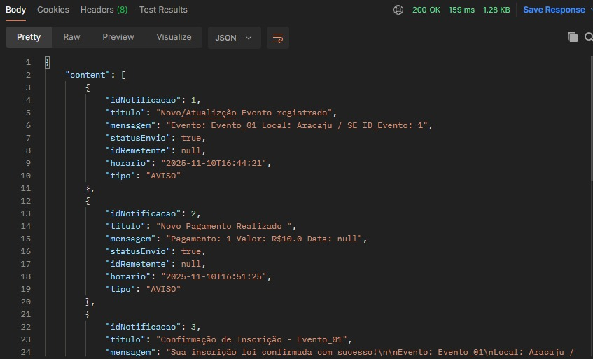

    Body do Response (JSON) quando passando um idUser válido mas não ADMINISTRADOR:

    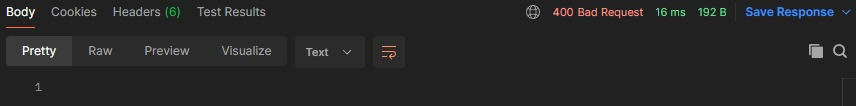

    Body do Response (JSON) quando passando um idUser não existe:

    

* **/notificacao/openNot/{id}**
    Body do Response (JSON) quando passando um idNotificação válido:

    

    Body do Response (JSON) quando passando um idNotificação inválido:

    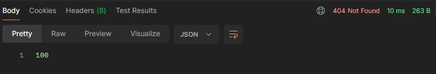

* **/notificacao/newNot/User/{id}**
    Body do Response (JSON) quando passando um idUser válido:

    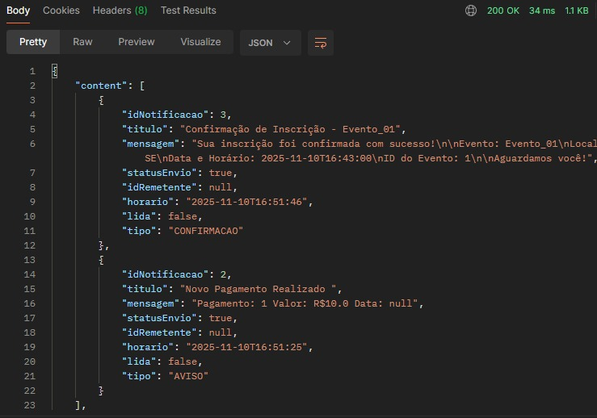

    Body do Response (JSON) quando passando um idUser não existe:

    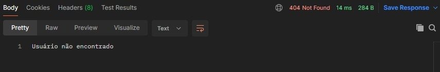


* **/notificacao/reciveByUser/{id}**
    Body do Response (JSON) quando passando um idUser válido:

    

    Body do Response (JSON) quando passando um idUser não existe:

    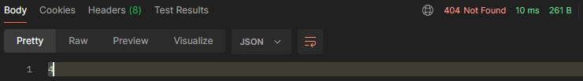

* **/notificacao/sendByUser/{id}**
    Body do Response (JSON) quando passando um idUser válido:

    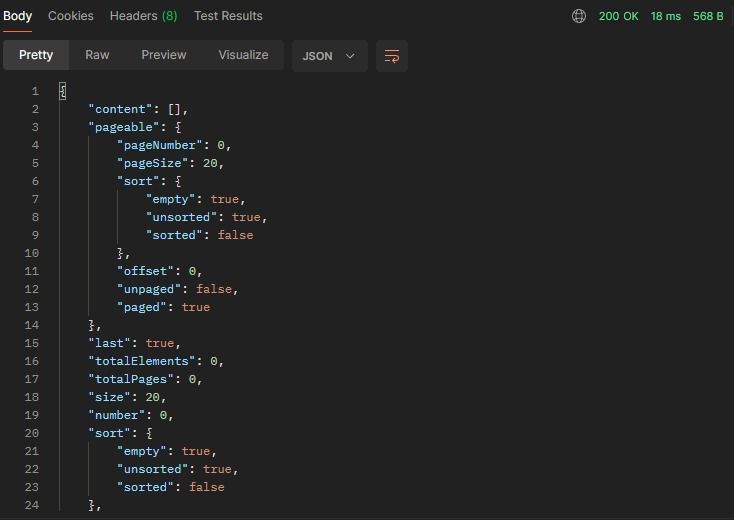
    
    Body do Response (JSON) quando passando um idUser válido mas não ADMINISTRADOR:

    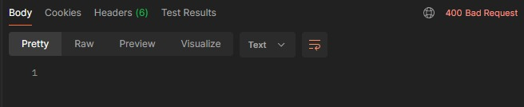

    Body do Response (JSON) quando passando um idUser não existe:

    


* **/notificacao/filterTipo/{tipo}**
    Body do Response (JSON) quando passando um tipo válido:

    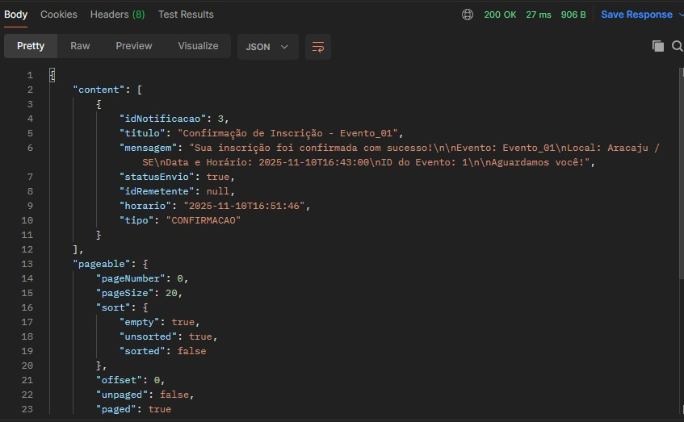

    Body do Response (JSON) quando passando um tipo inválido:

    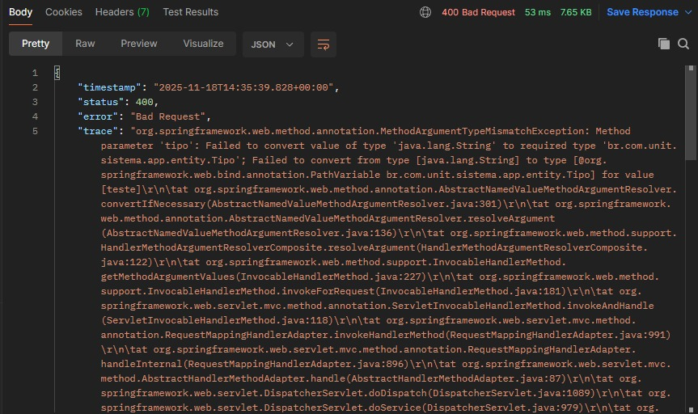

### Método POST
* **/notificacao**

    Body da requisição (JSON):
    ```json
    {
        "titulo": "Notificação Exemplo",
        "mensagem": "Menssagem Notificação Exemplo",
        "tipo": "ALERTA",
        "idRemetente": null,
        "destinatarios":[1]
    }
    ```
    O `"idRemetente": null` indica que a notificação vem do sistema.

    Body do Response (JSON):

    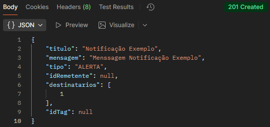

    Caso um dos campos `"titulo"`, `"mensagem"` e `"tipo"` estiverem em branco ou `"tipo"` não corresponder a LEMBRETE, ALERTA, CONFIRMACAO ou AVISO o Response retornará:

    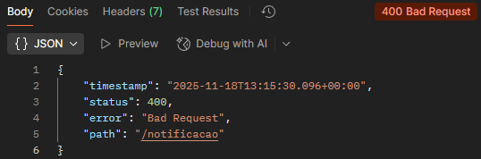
###  Método PUT

* **/notificacao**
(Marcar notificação como lida)
```json
{
    "idNotificacao": 1,
    "idUser": 1
}
```
Body do Response (JSON):

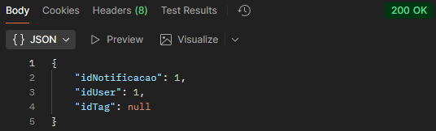

Caso um dos campos `"idNotificacao"` ou `"idUser"` estiverem verem com valores inválidos (Não encontrado) o Response retornará:

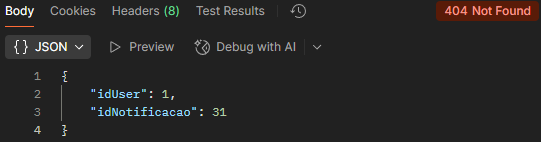

Caso um dos campos `"idNotificacao"` ou `"idUser"` estiverem sem valor algum ou valor não númerico o Response retornará:

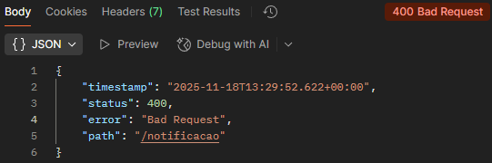

* **/notificacao/tag**


###  Método DELETE
* **/notificacao**
```json
{
    "idNotificacao": 1
}
```

Body do Response (JSON):

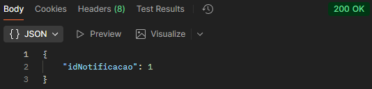

Caso o campo `"idNotificacao"` estiver com valor inválido (Não encontrado) o Response retornará:

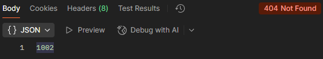

Caso o campo `"idNotificacao"` estiver sem valor algum ou valor não númerico o Response retornará:

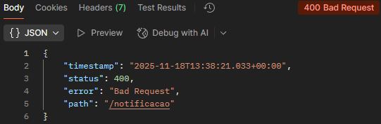


## Métodos

* __NotificacaoController__
    * __listarNotificacao(@PathVariable long id, Pageable paginacao)__\
    _Lista todas as notificações_  

    * __mostrarNotificacaoEspecifica(@PathVariable long id)__\
    _Exibe uma notificacao específica_  

    * __exibirNotificacoesNovas(@PathVariable long id, Pageable paginacao)__\
    _Lista as novas notificações de um usuário (não lidas)_  

    * __listarNotificacaoUsuario(@PathVariable long id, Pageable paginacao)__\
    _Lista todas as notificações de um usuário_  

    * __listarNotificacaoEnviada(@PathVariable long id, Pageable paginacao)__\
    _Lista todas as notificações enviadas por um usuário_  

    * __filtrarNotificacao(@PathVariable Tipo tipo, Pageable paginacao)__\
    _Listar notificações filtradas pelo tipo_  

    * __criarNotificacao(@RequestBody @Valid NotificacaoDTO dados)__\
    _Cria uma nova notificação_  

    * __marcarComoLida(@RequestBody @Valid NotificacaoLidaDTO dados)__\
    _Marcar uma notificação como lida_  

    * __atualizarTagNotificacao(@RequestBody @Valid NotificacaoLidaDTO dados)__\
    _Atualizar Tag da notificação_ 

    * __deletarNotificacao(@RequestBody NotificacaoDeletarDTO dados)__\
    _Deletar uma notificação_ 


* __NotificacaoService__
    * __gerarLogNotificacao(CriarLogNotificacaoDTO dados)__\
    _Salva um log de notificação_  

    * __gerarEmail(String destino, String assunto, String corpo)__\
    _Gera um email envia para o destinatário_  

    * __coletarNotificacao(long id,@PageableDefault Pageable paginacao)__\
    _Exibe todas as notificações registradas_  

    * __exibirNotificacaoEspecifica(long id)__\
    _Exibir uma notificação específico_  

    * __coletarNotificacaoUsuario(long id, @PageableDefault Pageable paginacao)__\
    _Exibir todas as notificações do usuário_  

    * __gerarPageNotificacaoUsuario(ArrayList<NotificacaoUsuario> lista, Pageable paginacao)__\
    _Converte um ArrayList<NotificacaoUsuario> em um Page e exibe as notificações de um usuário_  

    * __ordenarListaNotificacaoUsuario(long id,ArrayList<Long> lista, Pageable paginacao)__\
    _Ordena um ArrayList baseado em preferencia e idNotificacao_  
    
    * __exibirNotificacaoNLida(long id, @PageableDefault Pageable paginacao)__\
    _Exibir notificações não lidas de um usuário_  
    
    * __coletarNotificacaoEnviadas(long id, @PageableDefault Pageable paginacao)__\
    _Exibir notificações enviadas por um usuário_  
    
    * __filtrarNotificacaoTipo(Tipo tipo, @PageableDefault Pageable paginacao)__\
    _Filtra notificações pelo tipo_  
    
    * __salvarNotificacao(@Valid NotificacaoDTO dados)__\
    _Salva e registra uma nova notificação no banco de dados_ 

    * __atualizarNotificacao(@Valid NotificacaoLidaDTO dados)__\
    _Marcar uma notificação como lida no banco de dados_  

    * __atualizarTag(@Valid NotificacaoLidaDTO dados)__\
    _Atualizar Tag da notificação no banco de dados_ 

    * __apagarNotificacao(NotificacaoDeletarDTO dados)__\
    _Deleta uma notificação do banco de dados_ 

* __NotificacaoRepository__
    * __findByIdUser(long idUser, Pageable paginacao)__\
    _Retorna toda as notificações enviadas por aquele usuario_  

    * __findByTipo(Tipo tipo, Pageable paginacao)__\
    _Retorna as notificações filtradas por tipo_  

* __NotificacaoUsuarioRepository__
    * __findAllByIdUser(@Param("idUser") Long idUser, Pageable paginacao)__\
    _Retorna toda as notificações recebidas por aquele usuario_  

    * __getReferencedByIdUN(@Param("idUser") Long idUser, @Param("idNotificacao") Long idNotificacao)__\
    _Retorna uma NotificacaoUsuario pelo idNotificacaoUsuario_  

    * __findNewByIdUser(@Param("idUser") Long idUser)__\
    _Retorna toda as novas notificações recebidas por aquele usuario (não lidas)_  

    * __deleteByIdNotificacao(@Param("idNotificacao") Long idNotificacao)__\
    _Deleta todos NotificacaoUsuario que contenham um idNotificacao específico_  

* __PreferenciaController__
    * __listarPreferencias(Pageable paginacao)__\
    _Lista todas as Preferencias_  

    * __listarPreferenciaUsuario(@PathVariable long id, Pageable paginacao)__\
    _Lista todas as Preferencias de um usuário_  

    * __criarNovaPreferencia(@RequestBody criarPreferenciaDTO dados)__\
    _Cria uma nova Preferencia_  

    * __atualizarPreferencia(@RequestBody atualizarPreferenciaDTO dados)__\
    _Atualizar uma Preferência_ 

    * __deletePreferencia(@RequestBody deletarPreferenciaDTO dados)__\
    _Deletar uma Preferência_ 

* __PreferenciaService__
    * __listarPref(@PageableDefault Pageable paginacao)__\
    _Lista todas as Preferencias_  

    * __listarPrefUser(long idUser, Pageable paginacao)__\
    _Lista todas as Preferencias de um usuário_  

    * __cadastrarPref(@Valid criarPreferenciaDTO dados)__\
    _Cria uma nova Preferencia no banco de dados_  

    * __atualizarPref(@Valid atualizarPreferenciaDTO dados)__\
    _Atualizar uma Preferência no banco de dados_ 

    * __deletarPref(@Valid deletarPreferenciaDTO dados)__\
    _Deletar uma Preferência no banco de dados_ 

* __PreferenciaRepository__
    * __findAllByIdUser(@Param("idUser") Long idUser, Pageable paginacao)__\
    _Retorna toda as Preferências daquele usuario_  
